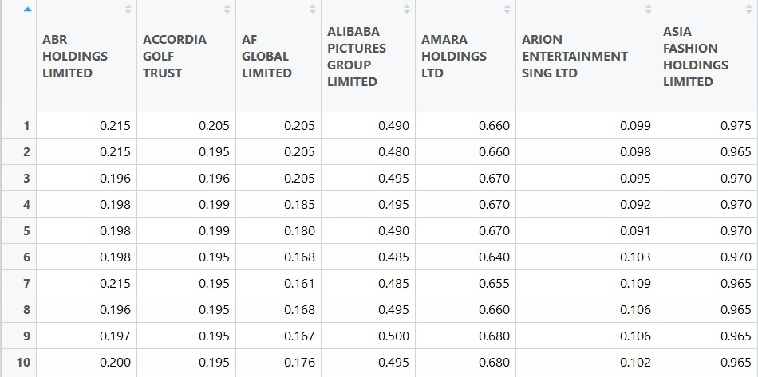
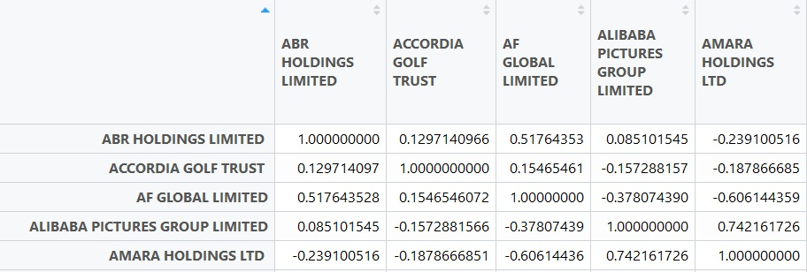
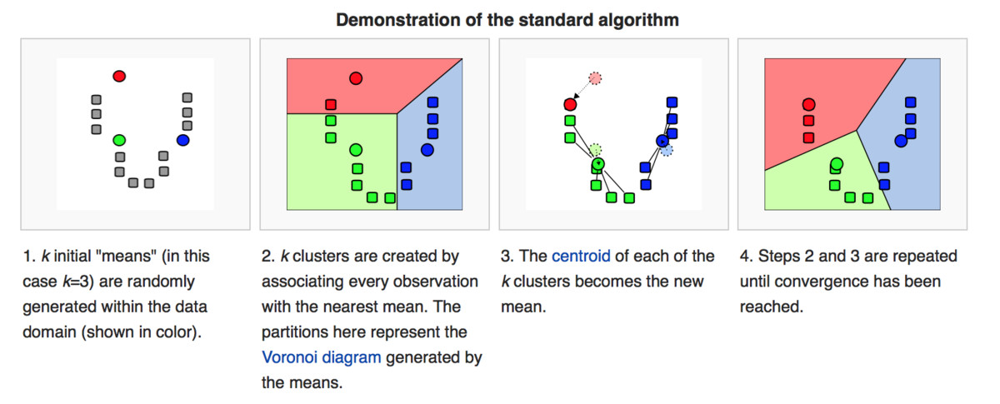
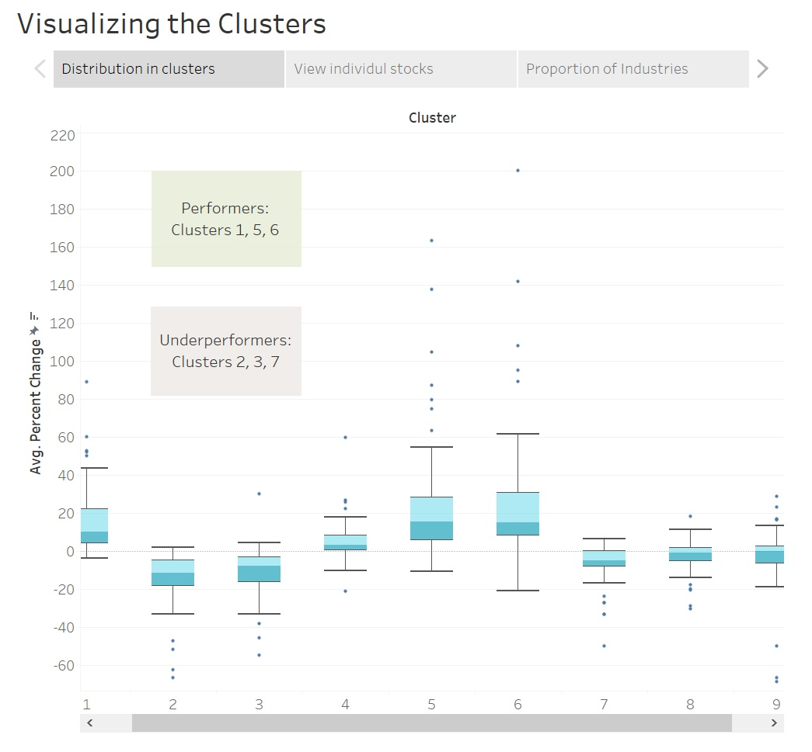
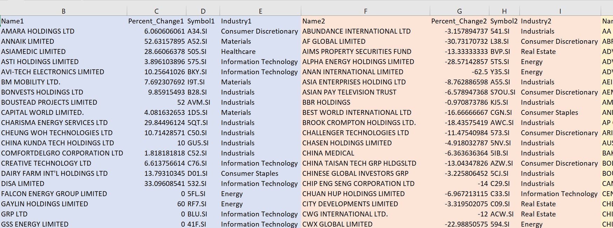

## Clustering every listed stock on SGX

An attempt at observing how stocks on SGX can be grouped based on their movements in Q417.

### Motivations

1. We tend to have a general understanding that stocks tend to move together in the same direction as the overall market. This happens to be the case even more so for stocks in the same industry. It is common knowledge that if there is hype or positive news about an industry in the country, they would be expected to rise together.

2. Observing how stocks move together is important in managing portfolios and risks. Investing only in a certain industry can heavily expose an investor to industry-related risks, such as low prices for energy stocks. Diversification is the most basic and effective way for investors to manage risk and reduce the volatility of an asset's price movements. 

3. I cleared my work in school and had an entire free day to do something.

The aim of this project is to 1) test those intuitions with some historical data to explore if that is the case for the last quarter and 2) find those baskets of stocks.

### Collecting the data
The quantmod library in R allows us to collect historic data of stocks on Yahoo Finance. SGX_StockName_Symbol_Industry.csv is a dataset that I created with all of the SGX stock names, symbols and industry they are in. I extracted the data from [Link](https://sginvestors.io/sgx/stock-listing/sector).

```markdown
# get list of all sti stock names in last quarter
stock_names = read.csv('SGX_StockName_Symbol_Industry.csv')
data <- new.env()
lapply(as.character(stock_names$Symbol), function(x){
  try(getSymbols(x,env=data, from = '2017-10-02', to = '2017-12-30'),silent=TRUE)
})
```

We are only interested in using the daily Close Price of each stock for our analysis and I might consider analysis on the Volume as well in the future.

```markdown
## get close price for each symbol
vec_of_stocks = c(numeric)
for(i in 1:length(ls(data))) {
  stock = as.data.frame(data[[ls(data)[i]]][,4])
  vec_of_stocks[i] = stock
}
```
### Cleaning
There are some stocks on Yahoo Finance which I am unable to retrieve with quantmod and there are also some which partially has NAs. Since it varies from time to time, I had to remove the entries manually which are index 22, 24, 28, 34, 50, 52, 216, 400, 401 of the SGX_StockName_Symbol_Industry.csv for this session. **There roughly 12% of SGX stocks which are not included due to the above reasons.**

The data also consists of entries of different lengths for some stocks which are probably due to some stocks closing on certain days or not having any trades. I used the previous available day's close to fill it up since they won't be expected to change anyway.

```markdown
# run this and count manually, removing nas
sapply(vec_of_stocks, function(x) length(x) >= 63)
errors_index = c(22, 24, 28, 34, 50, 52, 216, 400, 401)
errors_name = c()
for(index in errors_index) {
  errors_name = c(errors_name, ls(data)[index])
}
col_names = ls(data)
col_names = col_names[!col_names %in% errors_name]
column_names = as.character(stock_names[which(stock_names$Symbol %in% col_names),]$Name)

# make a DF with row as date and col as stock name
vec_of_stocks = vec_of_stocks[sapply(vec_of_stocks, function(x) length(x) >= 63)]
df_of_stocks = as.data.frame(vec_of_stocks)
names(df_of_stocks) = column_names

# replace na with previous known and remove those with constant values throughout
df_of_stocks = df_of_stocks %>% do(na.locf(.))
df_of_stocks = df_of_stocks[vapply(df_of_stocks, function(x) length(unique(x)) > 1, logical(1L))]
```
df_of_stocks should look like



### Using the Pearson correlation coefficient
_The correlation coefficient is used to measure both the degree and direction of the correlation between any two stocks. It can be anywhere between -1 and 1. It is used to select stocks in different industries that tend to move in tandem, or to hedge your bets by selecting stocks with a negative coefficient so that if one stock fails, the other is likely to get a boost. When stocks have a correlation coefficient of 0, it does not mean they never behave in the same way; rather, it means that they are as likely to move differently as they are to move together, making them unpredictable. However, this also means there is less likelihood that many noncorrelated stocks will fail simultaneously._

_Choosing a variety of stocks with different degrees and directions of correlation is one of the most common and effective diversification strategies. The result is a portfolio that displays a general upward trend, since, at any given time, at least one security should be doing well even if others are failing."_ - [Link](https://www.investopedia.com/ask/answers/021716/how-does-correlation-affect-stock-market.asp)

I calculated the 610x610 correlation matrix which compares the prices of every stock with every other stock (for everyday in the quarter). It is similar to finding the R-value between two stocks in Linear Regression for the trading days in a quarter but it is for 610x610. It should look like this.

```markdown
cor_matrix = cor(df_of_stocks)
```


I also calculated the %change from the start to the end of the quarter for each stock (to be used later)

```markdown
# find % change from first to last day in quarter
percent_change = numeric()
for(i in 1:ncol(df_of_stocks)) {
  percent_change[i] = (df_of_stocks[63,i] - df_of_stocks[1,i])/df_of_stocks[1,i] *100
}
```
### K-Means Clustering
K-Means is one of the most popular unsupervised machine learning methods for clustering. We plan to cluster the stocks based on how close they are in terms of their respective correlations. For example, if SPH and Starhub are in the same cluster while DBS is in another cluster, then the 609 correlations between SPH and every other stock would be closer to Starhub's than DBS'. 


from https://brilliant.org/wiki/k-means-clustering/

K-Means is fast (time complexity O(n)) and it's also easy to execute.

```markdown
clus <- kmeans(cor_matrix, centers=9)
par(cex=0.9, family="sans")
plotcluster(cor_matrix, clus$cluster)
```


The plot shows 9 clusters plotted against the 2 largest Principal Components which explains about 80% of the variability.
I started with 11 clusters which were the number of industries in our data and decreased it to 9 to reduce visible overlaps in the plot. 
Using the Within-cluster Sum of Square (WSS) and Gap Stat methods, the suggested number of clusters to use is 3 but it will not be much of a use for our interpretation later on.

```markdown
fviz_nbclust(cor_matrix, kmeans, method = "wss") #suggests 3
fviz_nbclust(cor_matrix, kmeans, nstart = 25,  method = "gap_stat", nboot = 10) #suggests 3
```

### Visualizations on Tableau
Visit the link below for live demo:
https://public.tableau.com/shared/W86WJG32N?:display_count=yes

I plotted boxplots of the %change in price from the start to the end of a quarter for each cluster. There seems to be clusters which are performing much better than the rest.



Below are the distributions of industries for each cluster and quite surprisingly they seem to be very evenly spread out. This implies that the stocks of the same industry may not necessarily move together more than a mixed basket of stocks.


The list of stocks in the 9 clusters are in the SGX_Stock_By_Cluster.csv file which looks like this. The dataset could help to gain insights about how some of the stocks you are interested is clustered.


### Hierarchical Clustering

This is another popular clustering method which builds clusters incrementally. The further apart stocks are across the branches, the more dissimilar they are in terms of how they move. This could be very useful if you would like to diversify your portfolio in terms of stock movements over the last quarter.

<embed src="https://jasonyip184.github.io/clustering_sgx_stocks/ss/HClust.pdf" type="application/pdf" />

For example, BUKIT SEMBAWANG ESTATES LTD (top) is the furthest from HI−P INTERNATIONAL LIMITED (bottom) and are most different.

### Future
Many more improvements can be made to improve the quality of analyses.

1. Using a longer timeframe for prices - I shortened it to simplify the data handling.
2. Scraping and using other key features such as Volume, Market Cap, Beta, PE ratio, EPS and financial ratios for clustering
3. Exploring more methods of clustering
4. Include other financial instruments such as bonds, currencies, commodities and derivatives.

Please share your comments or suggestions if you have any! jasonyip184@gmail.com

